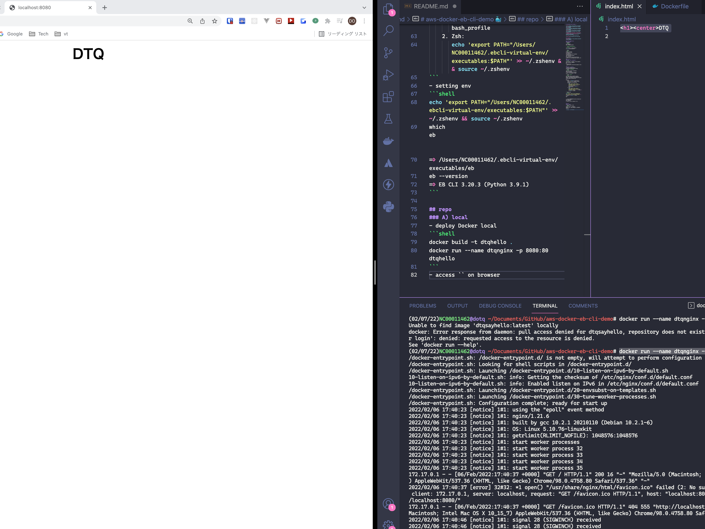
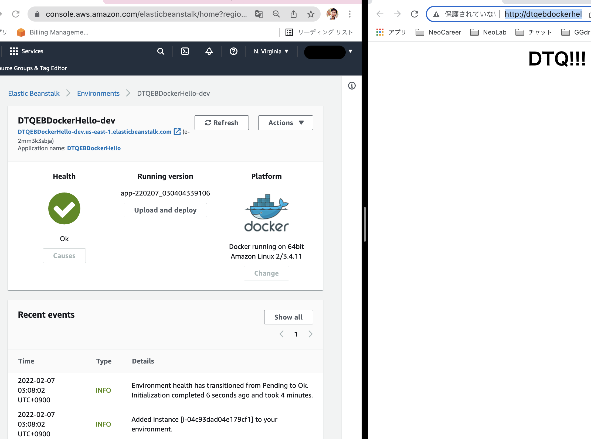

# aws-docker-eb-cli-demo 🐳


[](https://github.com/tquangdo/aws-docker-eb-cli-demo/issues/new)

## reference
[youtube](https://www.youtube.com/watch?v=4oCjtzxWWJs)

## install AWS EB CLI
### A) python
- upgrade:
```shell
brew upgrade
brew cleanup python3
```
- `alias python=python3`:
```shell
cat ~/.zshrc | grep python3
=> alias python=python3
```
- check:
```shell
python --version
=> Python 3.9.10
which python
=> python: aliased to python3
which python3
/usr/local/bin/python3
pip --version
=> pip 21.3.1 from /usr/local/lib/python3.9/site-packages/pip (python 3.9)
```
### B) EB
#### Way1: NOT recommend!!!
```shell
pip3 install --upgrade --user awsebcli
pip3 uninstall awsebcli
=>
Proceed (Y/n)? 
  Successfully uninstalled awsebcli-3.20.3
```
#### Way2: recommend
- https://github.com/aws/aws-elastic-beanstalk-cli-setup
- install `virtualenv`
```shell
sudo pip3 install virtualenv
which virtualenv
=> /usr/local/bin/virtualenv
python -m virtualenv --help
```
- install `ebcli`
```shell
git clone https://github.com/aws/aws-elastic-beanstalk-cli-setup.git
python ./aws-elastic-beanstalk-cli-setup/scripts/ebcli_installer.py
=>
Success!
    Note: To complete installation, ensure `eb` is in PATH. You can ensure this by executing:
    1. Bash:
       echo 'export PATH="/Users/NC00011462/.ebcli-virtual-env/executables:$PATH"' >> ~/.bash_profile && source ~/.bash_profile
    2. Zsh:
       echo 'export PATH="/Users/NC00011462/.ebcli-virtual-env/executables:$PATH"' >> ~/.zshenv && source ~/.zshenv
```
- setting env
```shell
echo 'export PATH="/Users/NC00011462/.ebcli-virtual-env/executables:$PATH"' >> ~/.zshenv && source ~/.zshenv
which eb                                                                                                    
=> /Users/NC00011462/.ebcli-virtual-env/executables/eb
eb --version
=> EB CLI 3.20.3 (Python 3.9.1)
```

## repo
### A) local
- deploy Docker local
```shell
docker build -t dtqhello .
docker run --name dtqnginx -p 8080:80 dtqhello
```
- access `localhost:8080` on browser

### B) AWS EB
- init:
```shell
eb init
=>
* Select an application to use=DTQEBDockerHello
* It appears you are using Docker. Is this correct? (Y/n):
* Select a platform branch.
1) Docker running on 64bit Amazon Linux 2
* Do you want to set up SSH for your instances?
(Y/n): n
```
-  will create folder `.elasticbeanstalk/config.yml`
```yml
application_name: DTQEBDockerHello
  ...
  default_platform: Docker running on 64bit Amazon Linux 2
```
- create:
```shell
eb create
* Select a load balancer type
1) classic
2) application
3) network
(default is 2): 
*
Printing Status:
2022-02-06 18:04:07    INFO    createEnvironment is starting.
2022-02-06 18:04:09    INFO    Using elasticbeanstalk-us-east-1-462123133781 as Amazon S3 storage bucket for environment data.
...
2022-02-06 18:08:01    INFO    Successfully launched environment: DTQEBDockerHello-dev
```
- check:
```shell
eb list
=> * DTQEBDockerHello-dev
eb status
=>
  CNAME: DTQEBDockerHello-dev.us-east-1.elasticbeanstalk.com
  Updated: 2022-02-06 18:08:01.670000+00:00
  Status: Ready
  Health: Green
eb open
```
- will show AWS EB's URL (content=`index.html`) with Docker icon

- In case change code: `eb deploy`
- last: `eb terminate --force`
> !!! ⚠️⚠️WARNING⚠️⚠️ !!!
> NOT auto terminate EB's Applicatin name & S3, must delete by manual!!!
